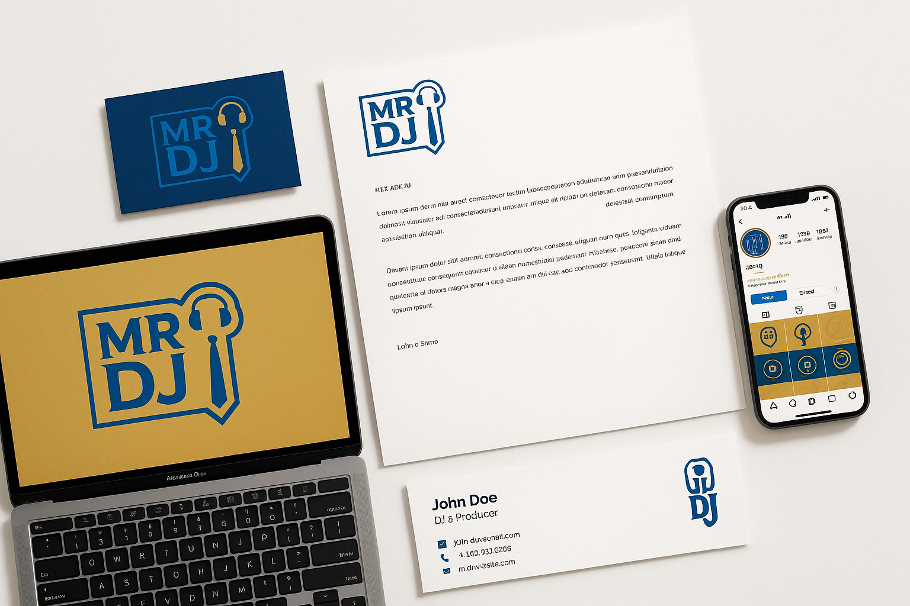

# Mister DJ Brand Guidelines
## Complete Visual Identity Manual

**Versie:** 2.0 Extended  
**Datum:** 11 Oktober 2025  
**Status:** Definitief  

---

## Inhoudsopgave

1. [Brand Essence](#1-brand-essence)
2. [Logo Systeem](#2-logo-systeem)
3. [Kleurenpalet](#3-kleurenpalet)
4. [Typografie](#4-typografie)
5. [Visuele Stijl](#5-visuele-stijl)
6. [Fotografie & Beeldmateriaal](#6-fotografie--beeldmateriaal)
7. [Iconografie & Grafische Elementen](#7-iconografie--grafische-elementen)
8. [Tone of Voice](#8-tone-of-voice)
9. [Brand Applicaties](#9-brand-applicaties)
10. [Digitale Richtlijnen](#10-digitale-richtlijnen)
11. [Print Specificaties](#11-print-specificaties)
12. [Do's & Don'ts](#12-dos--donts)

---

## 1. Brand Essence

### Merkpositionering

**Mister DJ** is **dé feestspecialist van het Zuiden** die onvergetelijke momenten creëert door professionele DJ-diensten te combineren met een persoonlijke aanpak en 100% dansgarantie.

### Brand Personality

- **Professioneel** - 15+ jaar ervaring, 2500+ succesvolle events
- **Betrouwbaar** - 100% dansgarantie, altijd op tijd, backup planning
- **Energiek** - Passie voor muziek en feesten
- **Persoonlijk** - Maatwerk voor elk event, persoonlijke aandacht
- **Premium** - Hoogwaardige apparatuur en service

### Mission Statement

> "Wij zorgen ervoor dat elk feest een onvergetelijke ervaring wordt door de perfecte muziekmix, professionele uitvoering en persoonlijke aandacht. Van intieme bruiloften tot grote corporate events - wij garanderen dat de dansvloer vol blijft."

### Vision Statement

> "De meest vertrouwde en gewaardeerde DJ-service in Zuid-Nederland zijn, bekend om onze 100% dansgarantie en het vermogen om elk event tot een succes te maken."

### Core Values

1. **Kwaliteit** - Alleen de beste apparatuur en service
2. **Betrouwbaarheid** - Altijd professioneel, altijd op tijd
3. **Passie** - Liefde voor muziek en feesten
4. **Maatwerk** - Elk event is uniek
5. **Dansgarantie** - Volle dansvloer of geld terug

### Target Audience

#### Primair (50%)
**Bruidsparen (25-35 jaar)**
- Budget: €800-€1,500
- Zoeken: Betrouwbaarheid, ervaring, persoonlijke aandacht
- Waarden: Kwaliteit, unieke ervaring, zorgeloos

#### Secundair (40%)
**Corporate Event Managers (30-50 jaar)**
- Budget: €1,200-€2,500
- Zoeken: Professionaliteit, flexibiliteit, netwerken
- Waarden: ROI, merkreputatie, employee engagement

#### Tertiair (10%)
**Private Party Hosts (30-60 jaar)**
- Budget: €600-€1,200
- Zoeken: Sfeer, muziekkennis, betaalbaarheid
- Waarden: Fun, kwaliteit, value for money

---

## 2. Logo Systeem

### Primair Logo


**Beschrijving:**  
Het Mister DJ logo bestaat uit de letters "MR DJ" in een strak rechthoekig frame, gecombineerd met een gestileerde figuur met koptelefoon en stropdas. Dit symboliseert de perfecte balans tussen professionaliteit (stropdas) en passie voor muziek (koptelefoon).

**Symboliek:**
- **Koptelefoon** - Muziek, DJ-expertise, geluidskwaliteit
- **Stropdas** - Professionaliteit, betrouwbaarheid, zakelijk
- **Rechthoekig frame** - Stabiliteit, structuur, kwaliteit
- **Blauwe kleur** - Vertrouwen, professionaliteit, premium


### Logo Variaties

#### Primair Logo (Full Color)
- **Gebruik:** Alle digitale en print toepassingen op witte achtergrond
- **Formaat:** PNG met transparante achtergrond
- **Minimale breedte:** 120px (digital), 30mm (print)

#### Logo op Donkere Achtergrond
- **Gebruik:** Website headers, social media banners, donkere materialen
- **Kleur:** Wit (#FFFFFF) of Bright Blue (#00AEEF)
- **Contrast:** Minimaal 4.5:1 ratio

#### Logo op Fotografie
- **Gebruik:** Marketing materiaal, social media posts
- **Achtergrond:** Gebruik witte of donkere overlay voor leesbaarheid
- **Opacity:** Minimaal 85% voor duidelijkheid

#### Favicon/App Icon
- **Formaat:** 512x512px, 256x256px, 128x128px, 64x64px, 32x32px, 16x16px
- **Design:** Vereenvoudigd koptelefoon + das icoon
- **Kleur:** Deep Navy op witte achtergrond

### Clear Space

**Minimale vrije ruimte rondom logo:** X = hoogte van de letter "M"

```
    X     X
  ┌───────────┐
X │  MR DJ    │ X
  │  [LOGO]   │
  └───────────┘
    X     X
```

**Nooit:**
- Logo kleiner dan minimale maat gebruiken
- Logo vervormen of uitrekken
- Logo roteren
- Logo combineren met andere logo's
- Kleuren aanpassen
- Effecten toevoegen (schaduwen, glows, etc.)

### Minimale Afmetingen

**Digital:**
- Website header: 180px breed
- Social media profile: 400x400px
- Email signature: 150px breed
- Favicon: 32x32px minimum

**Print:**
- Visitekaartje: 25mm breed
- Briefpapier: 40mm breed
- Banner/Roll-up: 150mm breed
- Flyer: 50mm breed

---

## 3. Kleurenpalet


### Primaire Kleuren

#### Deep Navy Blue (Hoofdkleur)
**HEX:** `#1A2C4B`  
**RGB:** R:26 G:44 B:75  
**CMYK:** C:65 M:41 Y:0 K:71  
**Pantone:** 19-4028 TCX (Dark Sapphire)

**Gebruik:**
- Primaire tekstkleur
- Headers en titels
- Achtergronden voor premium uitstraling
- Logo basis
- Website navigation

**Psychologie:** Vertrouwen, professionaliteit, stabiliteit, autoriteit

#### Bright Blue (Accent kleur)
**HEX:** `#00AEEF`  
**RGB:** R:0 G:174 B:239  
**CMYK:** C:100 M:27 Y:0 K:0  
**Pantone:** 299 C (Process Blue)

**Gebruik:**
- Call-to-action buttons
- Links en interactieve elementen
- Accenten in designs
- Social media highlights
- Grafische elementen

**Psychologie:** Energie, dynamiek, betrouwbaarheid, moderniteit

#### Gold (Premium accent)
**HEX:** `#D4AF37`  
**RGB:** R:212 G:175 B:55  
**CMYK:** C:0 M:17 Y:74 K:17  
**Pantone:** 7562 C (Metallic Gold)

**Gebruik:**
- Premium pakketten
- Awards en badges
- Highlights en speciale aanbiedingen
- Luxe events (bruiloften, galas)
- Decoratieve accenten

**Psychologie:** Luxe, kwaliteit, succes, waardering

### Secundaire Kleuren

#### White (Basis)
**HEX:** `#FFFFFF`  
**RGB:** R:255 G:255 B:255  
**CMYK:** C:0 M:0 Y:0 K:0

**Gebruik:**
- Achtergronden
- Negatieve ruimte
- Tekst op donkere achtergronden
- Clean, modern design

#### Light Grey (Neutraal)
**HEX:** `#F5F5F5`  
**RGB:** R:245 G:245 B:245  
**CMYK:** C:0 M:0 Y:0 K:4

**Gebruik:**
- Secundaire achtergronden
- Borders en dividers
- Subtiele secties
- Cards en containers

#### Dark Grey (Tekst)
**HEX:** `#333333`  
**RGB:** R:51 G:51 B:51  
**CMYK:** C:0 M:0 Y:0 K:80

**Gebruik:**
- Body tekst (alternatief voor navy)
- Subtitels
- Captions
- Minder prominente informatie

### Kleur Verhoudingen

**Ideale verdeling in designs:**
- **60%** Deep Navy Blue (dominant)
- **30%** White/Light Grey (neutraal)
- **10%** Bright Blue + Gold (accenten)

### Kleur Combinaties

#### Combinatie 1: Professional
- Deep Navy Blue + White + Bright Blue
- **Gebruik:** Corporate events, zakelijke communicatie

#### Combinatie 2: Premium
- Deep Navy Blue + Gold + White
- **Gebruik:** Bruiloften, luxe events, premium pakketten

#### Combinatie 3: Energetic
- Bright Blue + White + Deep Navy Blue
- **Gebruik:** Social media, jonge doelgroep, party events

### Toegankelijkheid (WCAG 2.1)

**Contrast Ratios:**
- Deep Navy op White: 12.6:1 (AAA) ✓
- Bright Blue op White: 3.2:1 (AA voor grote tekst) ⚠
- Gold op White: 2.8:1 (Alleen decoratief) ⚠
- White op Deep Navy: 12.6:1 (AAA) ✓
- Deep Navy op Bright Blue: 4.1:1 (AA) ✓

**Aanbeveling:** Gebruik Bright Blue en Gold alleen voor accenten en grote elementen, niet voor body tekst.

---

## 4. Typografie


### Primair Lettertype: Montserrat

**Ontwerper:** Julieta Ulanovsky  
**Type:** Geometric Sans-serif  
**Licentie:** Open Font License (gratis)  
**Google Fonts:** https://fonts.google.com/specimen/Montserrat

**Waarom Montserrat?**
- Modern en professioneel
- Uitstekende leesbaarheid op alle schermen
- Breed scala aan gewichten (Thin tot Black)
- Gratis en web-safe
- Geometrische vormen passen bij logo

### Typografie Hiërarchie

#### H1 - Main Headline
**Font:** Montserrat Bold  
**Size:** 48px / 3rem (desktop), 36px / 2.25rem (mobile)  
**Line Height:** 1.2  
**Letter Spacing:** -0.5px  
**Color:** Deep Navy Blue (#1A2C4B)  
**Gebruik:** Pagina titels, hero sections

**Voorbeeld:**  
# Mister DJ - Dé Feestspecialist

#### H2 - Section Heading
**Font:** Montserrat SemiBold  
**Size:** 36px / 2.25rem (desktop), 28px / 1.75rem (mobile)  
**Line Height:** 1.3  
**Letter Spacing:** -0.3px  
**Color:** Deep Navy Blue (#1A2C4B)  
**Gebruik:** Sectie koppen, belangrijke titels

**Voorbeeld:**  
## Onze Diensten

#### H3 - Subsection Heading
**Font:** Montserrat SemiBold  
**Size:** 28px / 1.75rem (desktop), 24px / 1.5rem (mobile)  
**Line Height:** 1.4  
**Letter Spacing:** 0px  
**Color:** Deep Navy Blue (#1A2C4B)  
**Gebruik:** Subsecties, card titels

**Voorbeeld:**  
### Bruiloft DJ Pakket

#### H4 - Minor Heading
**Font:** Montserrat Medium  
**Size:** 20px / 1.25rem  
**Line Height:** 1.5  
**Letter Spacing:** 0px  
**Color:** Deep Navy Blue (#1A2C4B)  
**Gebruik:** Kleinere koppen, list headers

#### Body Text - Regular
**Font:** Montserrat Regular  
**Size:** 16px / 1rem  
**Line Height:** 1.6  
**Letter Spacing:** 0px  
**Color:** Dark Grey (#333333)  
**Gebruik:** Alle body tekst, paragrafen

**Voorbeeld:**  
Met meer dan 15 jaar ervaring en 2500+ succesvolle events, weet Mister DJ precies hoe elk feest een onvergetelijke ervaring wordt.

#### Body Text - Bold
**Font:** Montserrat SemiBold  
**Size:** 16px / 1rem  
**Line Height:** 1.6  
**Color:** Deep Navy Blue (#1A2C4B)  
**Gebruik:** Emphasis, belangrijke informatie

#### Caption / Small Text
**Font:** Montserrat Regular  
**Size:** 14px / 0.875rem  
**Line Height:** 1.5  
**Color:** Dark Grey (#333333)  
**Gebruik:** Captions, disclaimers, metadata

#### Button Text
**Font:** Montserrat SemiBold  
**Size:** 16px / 1rem  
**Line Height:** 1  
**Letter Spacing:** 0.5px  
**Text Transform:** Uppercase  
**Color:** White (#FFFFFF)  
**Gebruik:** Call-to-action buttons

**Voorbeeld:**  
**VRAAG OFFERTE AAN**

### Secundair Lettertype: Georgia (Optioneel)

**Gebruik:** Quotes, testimonials, emotionele content  
**Type:** Serif  
**Weights:** Regular, Italic, Bold

**Voorbeeld testimonial:**
> *"Mister DJ maakte onze bruiloft onvergetelijk! De dansvloer was de hele avond vol en de muziekkeuze was perfect."*  
> — Sarah & Tom, Bruiloft 2024

### Typografie Do's & Don'ts

**DO:**
✓ Gebruik Montserrat voor alle headers en body tekst  
✓ Respecteer de hiërarchie (H1 > H2 > H3 > Body)  
✓ Gebruik voldoende witruimte tussen tekstelementen  
✓ Zorg voor minimaal 1.6 line-height voor body tekst  
✓ Gebruik SemiBold voor emphasis in plaats van Bold  

**DON'T:**
✗ Gebruik geen andere fonts zonder goedkeuring  
✗ Gebruik niet meer dan 3 font sizes op één pagina  
✗ Gebruik geen ALL CAPS voor lange teksten  
✗ Stretch of compress fonts niet  
✗ Gebruik geen te kleine font sizes (<14px voor body)  

---

## 5. Visuele Stijl

### Design Principes

#### 1. Clean & Modern
- Veel witruimte
- Minimalistisch design
- Focus op content
- Geen overload aan elementen

#### 2. Professional & Premium
- Hoogwaardige fotografie
- Strakke layouts
- Consistente styling
- Aandacht voor detail

#### 3. Energetic & Dynamic
- Levendige kleuren (Bright Blue, Gold)
- Beweging in designs
- Dynamische composities
- Inspirerende beelden

### Layout Principes

#### Grid Systeem
**12-column grid** voor responsive designs

**Desktop (1200px+):**
- Container: 1140px max-width
- Gutter: 30px
- Columns: 12

**Tablet (768px - 1199px):**
- Container: 960px max-width
- Gutter: 20px
- Columns: 12

**Mobile (<768px):**
- Container: 100% width
- Gutter: 15px
- Columns: 4

#### Spacing Systeem
**8px base unit** voor consistente spacing

- **4px** - Zeer kleine spacing (icon padding)
- **8px** - Kleine spacing (tussen elementen)
- **16px** - Medium spacing (paragraaf margins)
- **24px** - Grote spacing (sectie padding)
- **32px** - Extra grote spacing (tussen secties)
- **48px** - Hero spacing
- **64px** - Page margins

### Grafische Elementen

#### Gradients
**Primary Gradient (Navy to Blue):**
```css
background: linear-gradient(135deg, #1A2C4B 0%, #00AEEF 100%);
```
**Gebruik:** Headers, hero sections, premium elements

**Gold Accent Gradient:**
```css
background: linear-gradient(135deg, #D4AF37 0%, #F4D03F 100%);
```
**Gebruik:** Premium badges, special offers

#### Borders & Lines
- **Border Width:** 2px voor accenten, 1px voor subtiele dividers
- **Border Color:** Bright Blue (#00AEEF) voor actieve elementen
- **Border Radius:** 4px voor subtiele rounding, 8px voor cards

#### Shadows
**Subtle Shadow (Cards):**
```css
box-shadow: 0 2px 8px rgba(26, 44, 75, 0.1);
```

**Medium Shadow (Hover states):**
```css
box-shadow: 0 4px 16px rgba(26, 44, 75, 0.15);
```

**Strong Shadow (Modals):**
```css
box-shadow: 0 8px 32px rgba(26, 44, 75, 0.2);
```

#### Buttons

**Primary Button:**
- Background: Bright Blue (#00AEEF)
- Text: White, Montserrat SemiBold, 16px, Uppercase
- Padding: 12px 32px
- Border Radius: 4px
- Hover: Darken 10%
- Transition: 0.3s ease

**Secondary Button:**
- Background: Transparent
- Border: 2px solid Bright Blue
- Text: Bright Blue, Montserrat SemiBold
- Hover: Background Bright Blue, Text White

**Premium Button:**
- Background: Gold Gradient
- Text: Deep Navy, Montserrat Bold
- Box Shadow: 0 4px 12px rgba(212, 175, 55, 0.3)

---

## 6. Fotografie & Beeldmateriaal

### Fotografie Stijl

#### Kenmerken
- **Authentiek** - Echte events, echte emoties
- **Energiek** - Beweging, dansende mensen, actie
- **Professioneel** - Hoge kwaliteit, goede belichting
- **Emotioneel** - Blijdschap, vreugde, verbinding

#### Compositie
- **Focus:** Mensen, interactie, emotie
- **Perspectief:** Eye-level of slightly above
- **Framing:** Rule of thirds
- **Depth of Field:** Shallow voor portraits, deep voor crowd shots

#### Kleuren & Belichting
- **Kleurtoon:** Warm en uitnodigend
- **Belichting:** Natuurlijk of professioneel event lighting
- **Saturation:** Medium tot hoog voor energie
- **Contrast:** Medium voor professionele uitstraling

### Foto Categorieën

#### 1. Event Fotografie (60%)
**Onderwerpen:**
- Dansende gasten op volle dansvloer
- DJ achter de draaitafel
- Bruidsparen, jubilaris, corporate gasten
- Sfeerbeelden van locaties
- Apparatuur en setup

**Gebruik:** Website, social media, marketing materiaal

#### 2. Portrait Fotografie (20%)
**Onderwerpen:**
- DJ portret (professioneel)
- Tevreden klanten
- Team members

**Gebruik:** About page, team page, testimonials

#### 3. Detail Fotografie (20%)
**Onderwerpen:**
- Professionele apparatuur
- Koptelefoon close-ups
- Lichteffecten
- Venue details
- Decoratie elementen

**Gebruik:** Service pages, portfolio, Instagram

### Beeldbewerking Richtlijnen

#### Filters & Effecten
**DO:**
✓ Lichte kleurcorrectie voor consistentie
✓ Verhoog contrast en scherpte subtiel
✓ Crop voor betere compositie
✓ Voeg logo watermark toe (rechtsonder, 50% opacity)

**DON'T:**
✗ Overdreven filters of effecten
✗ Black & white (tenzij specifiek artistiek)
✗ Vervorming of extreme cropping
✗ Te veel saturation

#### Logo Overlay op Foto's
- **Positie:** Rechtsonder of linksonder
- **Grootte:** 10-15% van foto breedte
- **Kleur:** Wit met 70% opacity, of gebruik overlay
- **Padding:** 20px vanaf randen

### Stock Fotografie

**Toegestaan wanneer:**
- Eigen fotografie niet beschikbaar is
- Voor algemene concepten (muziek, feest, technologie)
- Als placeholder tijdens ontwikkeling

**Vereisten:**
- Hoge resolutie (minimaal 1920px breed)
- Authentieke uitstraling (geen overdreven geposeerde stockfoto's)
- Diverse representatie
- Licentie voor commercieel gebruik

**Aanbevolen bronnen:**
- Unsplash (gratis, hoge kwaliteit)
- Pexels (gratis, diverse collectie)
- Adobe Stock (betaald, premium kwaliteit)

---

## 7. Iconografie & Grafische Elementen

### Icoon Stijl

#### Lijn Iconen (Primary)
- **Stijl:** Outline/line icons
- **Stroke Width:** 2px
- **Kleur:** Deep Navy Blue (#1A2C4B) of Bright Blue (#00AEEF)
- **Grootte:** 24px, 32px, 48px, 64px
- **Gebruik:** UI elementen, features, services

**Voorbeelden:**
- 🎧 Koptelefoon (DJ services)
- 💍 Ring (bruiloften)
- 🏢 Gebouw (corporate events)
- 🎵 Muzieknoot (muziek)
- ⭐ Ster (reviews, premium)
- ✓ Vinkje (features, garanties)
- 📅 Kalender (booking)
- 📍 Locatie (venues)

#### Gevulde Iconen (Accent)
- **Stijl:** Solid/filled icons
- **Kleur:** Bright Blue (#00AEEF) of Gold (#D4AF37)
- **Gebruik:** Call-to-action, highlights, badges

### Icoon Bibliotheek

**Aanbevolen sets:**
- **Feather Icons** - Clean, modern line icons
- **Font Awesome** - Breed scala, web-safe
- **Material Icons** - Google's icon set
- **Heroicons** - Tailwind's icon set

**Consistentie:**
- Gebruik één icon set per project
- Mix geen verschillende stijlen
- Houd dezelfde stroke width aan

### Grafische Patronen

#### Geometrische Patronen
**Gebruik:** Achtergronden, headers, decoratieve elementen

**Patroon 1: Diagonal Lines**
```css
background: repeating-linear-gradient(
  45deg,
  #1A2C4B,
  #1A2C4B 10px,
  #2A3C5B 10px,
  #2A3C5B 20px
);
```

**Patroon 2: Dots**
- Kleine dots in Bright Blue
- Subtiele opacity (10-20%)
- Gebruik als texture

#### Muziek Gerelateerde Elementen
- **Geluidsgolven** - Dynamische visualisaties
- **Equalizer bars** - Ritmische patronen
- **Vinyl records** - Nostalgische touch
- **Muzieknoten** - Decoratieve accenten

### Badges & Labels

#### "100% Dansgarantie" Badge
- **Shape:** Circle of shield
- **Colors:** Gold gradient background, Deep Navy text
- **Icon:** Vinkje of ster
- **Size:** 80px x 80px minimum
- **Gebruik:** Prominent op homepage, offertes, marketing

#### "15+ Jaar Ervaring" Badge
- **Shape:** Rectangular banner
- **Colors:** Deep Navy background, Gold accent
- **Typography:** Montserrat Bold
- **Gebruik:** About section, credentials

#### "2500+ Events" Counter
- **Style:** Large number with icon
- **Animation:** Count-up effect on scroll
- **Colors:** Bright Blue number, Deep Navy text

---

## 8. Tone of Voice

### Merk Persoonlijkheid

**Professioneel maar Toegankelijk**
- Formeel genoeg voor corporate clients
- Vriendelijk genoeg voor bruidsparen
- Enthousiast maar niet overdreven
- Betrouwbaar en ervaren

### Communicatie Stijl

#### Kenmerken
1. **Direct** - Kom snel to the point
2. **Positief** - Focus op mogelijkheden, niet beperkingen
3. **Persoonlijk** - Spreek de lezer direct aan ("jij/je")
4. **Enthousiast** - Toon passie voor muziek en feesten
5. **Betrouwbaar** - Onderbouw claims met feiten

#### Taalgebruik

**DO:**
✓ Gebruik actieve zinnen: "Wij zorgen voor..." i.p.v. "Er wordt gezorgd voor..."
✓ Spreek de klant direct aan: "Jouw bruiloft verdient..."
✓ Gebruik concrete voorbeelden: "2500+ events" i.p.v. "veel events"
✓ Toon enthousiasme: "We kunnen niet wachten om..."
✓ Wees specifiek: "100% dansgarantie" i.p.v. "goede sfeer"

**DON'T:**
✗ Gebruik geen jargon of technische termen zonder uitleg
✗ Wees niet te formeel of afstandelijk
✗ Gebruik geen clichés: "state of the art", "cutting edge"
✗ Maak geen ongefundeerde claims
✗ Gebruik geen negatieve taal

### Content Voorbeelden

#### Homepage Hero
**Goed:**
> "Maak van jouw feest een onvergetelijke ervaring. Met 15+ jaar ervaring en onze unieke 100% dansgarantie zorgen wij ervoor dat de dansvloer de hele avond vol blijft."

**Slecht:**
> "Wij bieden professionele DJ-diensten aan voor diverse evenementen met state-of-the-art apparatuur en jarenlange ervaring in de branche."

#### Call-to-Action
**Goed:**
- "Vraag nu je gratis offerte aan"
- "Ontdek onze pakketten"
- "Boek jouw DJ vandaag"
- "Plan een vrijblijvend gesprek"

**Slecht:**
- "Klik hier"
- "Meer informatie"
- "Contact"
- "Verzenden"

#### Email Opening
**Goed:**
> "Hoi Sarah en Tom,
> 
> Bedankt voor jullie interesse in Mister DJ! We zijn enthousiast om meer te horen over jullie bruiloft op 15 juni 2026."

**Slecht:**
> "Geachte heer/mevrouw,
> 
> Naar aanleiding van uw aanvraag sturen wij u hierbij de gevraagde informatie toe."

#### Social Media Post
**Goed:**
> "🎉 Weer een onvergetelijke avond! Deze bruiloft in Eindhoven was EPIC - van de eerste dans tot de laatste song. Bedankt Sarah & Tom voor het vertrouwen! 💙
> 
> #MisterDJ #BruiloftDJ #Dansgarantie #Eindhoven"

**Slecht:**
> "Mister DJ heeft afgelopen weekend een bruiloft verzorgd in Eindhoven. Het evenement was succesvol en de klanten waren tevreden."

### Tone per Kanaal

#### Website
- **Tone:** Professioneel, informatief, overtuigend
- **Lengte:** Medium tot lang (300-500 woorden per pagina)
- **Focus:** SEO, conversie, autoriteit

#### Social Media
- **Tone:** Energiek, persoonlijk, visueel
- **Lengte:** Kort (50-150 woorden)
- **Focus:** Engagement, community, behind-the-scenes

#### Email
- **Tone:** Persoonlijk, vriendelijk, actionable
- **Lengte:** Kort tot medium (150-300 woorden)
- **Focus:** Relatie, conversie, service

#### Print (Flyers, Brochures)
- **Tone:** Professioneel, premium, overtuigend
- **Lengte:** Zeer kort (headlines + bullets)
- **Focus:** Impact, memorability, contact info

---

## 9. Brand Applicaties



### Visitekaartje

**Formaat:** 85mm x 55mm (standaard)

**Voorkant:**
- Logo (links of gecentreerd)
- Naam: "Mister DJ"
- Tagline: "Dé feestspecialist van het Zuiden"
- Achtergrond: Deep Navy met subtiel patroon

**Achterkant:**
- Contactgegevens:
  - Telefoon: +31 (0) 40 8422594
  - Email: info@mr-dj.nl
  - Website: www.mr-dj.nl
  - Adres: Kapteijnlaan 17, 5505 AV Veldhoven
- KvK: 68906277
- Social media icons
- Achtergrond: Wit met Bright Blue accent

**Materiaal:** 350gsm mat gelamineerd karton

### Briefpapier

**Formaat:** A4 (210mm x 297mm)

**Header:**
- Logo (linksboven, 40mm breed)
- Bedrijfsnaam en tagline (rechts van logo)
- Lijn in Bright Blue onder header (2px)

**Footer:**
- Contactgegevens (gecentreerd)
- KvK nummer
- Website en social media
- Lijn in Bright Blue boven footer (1px)

**Marges:**
- Top: 40mm (incl. header)
- Bottom: 30mm (incl. footer)
- Left/Right: 25mm

### Email Handtekening

```html
<table style="font-family: Montserrat, Arial, sans-serif; font-size: 14px; color: #333;">
  <tr>
    <td style="padding-right: 20px;">
      
    </td>
    <td>
      <strong style="color: #1A2C4B; font-size: 16px;">Mister DJ</strong><br>
      <span style="color: #00AEEF;">Dé feestspecialist van het Zuiden</span><br>
      <br>
      📞 +31 (0) 40 8422594<br>
      ✉️ info@mr-dj.nl<br>
      🌐 www.mr-dj.nl<br>
      <br>
      <a href="[facebook]"></a>
      <a href="[instagram]"></a>
    </td>
  </tr>
</table>
```

### Social Media Profielen

#### Facebook
- **Profile Picture:** Logo (400x400px)
- **Cover Photo:** 820x312px
  - Foto van DJ achter draaitafel
  - Logo (linksboven)
  - Tagline en USP's
  - "100% Dansgarantie" badge

#### Instagram
- **Profile Picture:** Logo (320x320px)
- **Bio:**
  ```
  🎧 Dé feestspecialist van het Zuiden
  💯 100% Dansgarantie
  🎉 15+ jaar | 2500+ events
  💍 Bruiloften | 🏢 Corporate | 🎊 Feesten
  📍 Veldhoven & omgeving
  👇 Boek nu je DJ
  ```
- **Highlights Covers:** Cirkel met icoon, Bright Blue achtergrond

#### LinkedIn
- **Profile Picture:** Logo (400x400px)
- **Banner:** 1584x396px
  - Professionele foto corporate event
  - Logo en tagline
  - Focus op zakelijke diensten

### Website Elements

#### Favicon
- **Formaat:** 32x32px, 16x16px
- **Design:** Vereenvoudigd koptelefoon icoon
- **Kleur:** Deep Navy op transparant

#### Loading Spinner
- **Design:** Rotating vinyl record of koptelefoon
- **Kleur:** Bright Blue
- **Size:** 48px x 48px

#### 404 Page
- **Headline:** "Deze pagina is off the record"
- **Subtext:** "De pagina die je zoekt bestaat niet (meer)"
- **CTA:** "Terug naar home" button
- **Visual:** Koptelefoon illustratie

---

## 10. Digitale Richtlijnen

### Website Design

#### Homepage Structure
1. **Hero Section**
   - Full-width achtergrond foto
   - Headline + subheadline
   - Primary CTA button
   - Scroll indicator

2. **USP Section**
   - 3-4 key benefits met iconen
   - "100% Dansgarantie" prominent
   - Statistieken (15+ jaar, 2500+ events)

3. **Services Overview**
   - 3 hoofdcategorieën (Bruiloft, Corporate, Private)
   - Card layout met foto's
   - "Meer info" links

4. **Social Proof**
   - Testimonials carousel
   - Review scores (10/10, 5/5)
   - Logo's van bekende klanten

5. **CTA Section**
   - "Vraag offerte aan" formulier
   - Contact informatie
   - Trust badges

#### Responsive Breakpoints
- **Desktop:** 1200px+
- **Laptop:** 992px - 1199px
- **Tablet:** 768px - 991px
- **Mobile:** <768px

#### Performance
- **Page Load:** <3 seconden
- **Image Optimization:** WebP formaat, lazy loading
- **Minification:** CSS, JS, HTML
- **Caching:** Browser caching enabled

### Social Media Templates

#### Instagram Post (1080x1080px)
**Template Elementen:**
- Achtergrond: Event foto of gradient
- Logo: Rechtsonder (100px, 70% opacity)
- Text Overlay: Headline in Montserrat Bold
- Hashtags: In caption, niet op afbeelding

**Content Types:**
- Event highlights (70%)
- Behind-the-scenes (15%)
- Tips & tricks (10%)
- Promotional (5%)

#### Instagram Story (1080x1920px)
**Template Elementen:**
- Full-screen foto of video
- Logo: Bovenkant (80px)
- Text: Montserrat Bold, wit met schaduw
- CTA: "Swipe up" of "Link in bio"
- Stickers: Polls, questions, countdowns

#### Facebook Post
**Image:** 1200x630px
**Text:** 100-150 karakters
**Hashtags:** 2-3 relevante hashtags
**CTA:** "Meer info", "Boek nu", "Vraag offerte"

### Email Templates

#### Structuur
1. **Header**
   - Logo (gecentreerd, 150px breed)
   - Navigatie (optioneel)

2. **Hero**
   - Afbeelding (600px breed)
   - Headline (H1)

3. **Body**
   - Content blocks (tekst + afbeeldingen)
   - Witruimte tussen secties

4. **CTA**
   - Primary button (gecentreerd)
   - Secondary link (optioneel)

5. **Footer**
   - Contactgegevens
   - Social media links
   - Unsubscribe link

#### Email Best Practices
- **Max Width:** 600px
- **Font Size:** Minimaal 14px voor body
- **CTA Button:** Minimaal 44px hoog (touch-friendly)
- **Alt Text:** Voor alle afbeeldingen
- **Plain Text:** Altijd plain text versie meesturen

### Online Advertising

#### Google Ads
**Responsive Search Ads:**
- **Headlines (15):** 30 karakters max
  - "Professionele DJ Bruiloft"
  - "100% Dansgarantie"
  - "15+ Jaar Ervaring"
  - "Boek Mister DJ"
  
- **Descriptions (4):** 90 karakters max
  - "Maak van jouw feest een onvergetelijke ervaring met Mister DJ"
  - "2500+ succesvolle events | Gratis offerte | Veldhoven & omgeving"

**Display Ads:**
- **Formaten:** 300x250, 728x90, 160x600, 300x600
- **Design:** Logo + headline + CTA
- **Kleuren:** Brand kleuren consistent
- **Animation:** Subtiel, max 5 seconden

#### Facebook/Instagram Ads
**Image Ads:** 1080x1080px (square) of 1080x1350px (portrait)
**Video Ads:** 1080x1080px, max 60 seconden
**Carousel Ads:** 1080x1080px per card, 2-10 cards
**Text:** Max 125 karakters (voor optimale weergave)
**CTA Button:** "Meer informatie", "Boek nu", "Contact opnemen"

---

## 11. Print Specificaties

### Algemene Print Richtlijnen

#### Kleurmodus
- **CMYK** voor alle print materialen
- **RGB** alleen voor digitale weergave
- **Pantone** voor specifieke merkkleuren (optioneel)

#### Resolutie
- **Minimaal:** 300 DPI
- **Aanbevolen:** 300-600 DPI voor foto's
- **Vector:** Waar mogelijk (logo, iconen, tekst)

#### Bleed & Safe Zone
- **Bleed:** 3mm aan alle kanten
- **Safe Zone:** 5mm vanaf snijlijn
- **Belangrijke elementen:** Minimaal 10mm vanaf rand

### Flyer (A5 - 148x210mm)

**Layout:**
- **Voorkant:**
  - Hero afbeelding (full bleed)
  - Logo (linksboven)
  - Headline (groot, prominent)
  - USP's (bullets met iconen)
  - CTA (onderaan)

- **Achterkant:**
  - Diensten overzicht
  - Pakketten & prijzen
  - Contactgegevens (prominent)
  - Social media
  - QR code naar website

**Materiaal:** 170gsm glanzend papier

### Brochure (A4 gevouwen tot A5)

**Pagina's:**
1. **Cover:** Logo, tagline, hero afbeelding
2. **Inside Left:** Over Mister DJ, ervaring, USP's
3. **Inside Center:** Diensten & pakketten
4. **Inside Right:** Testimonials, reviews, foto's
5. **Back Cover:** Contact, CTA, social media

**Materiaal:** 200gsm mat gelamineerd papier

### Banner/Roll-up (85x200cm)

**Zones:**
- **Top (0-50cm):** Logo, headline
- **Middle (50-150cm):** Hero afbeelding, USP's, diensten
- **Bottom (150-200cm):** CTA, contactgegevens, QR code

**Materiaal:** PVC banner, mat finish

**Opmerking:** Houd rekening met 30cm vanaf onderkant voor roll-up cassette

### Poster (A3 - 297x420mm)

**Layout:**
- Verticaal formaat
- Hero afbeelding (2/3 van poster)
- Headline + subheadline
- 3-4 key benefits
- CTA + contactgegevens

**Materiaal:** 200gsm zijdeglans papier

---

## 12. Do's & Don'ts

### Logo Do's & Don'ts

**DO:**
✓ Gebruik altijd de officiële logo bestanden
✓ Respecteer de minimale grootte (120px / 30mm)
✓ Zorg voor voldoende clear space rondom
✓ Gebruik logo op witte of donkere achtergronden
✓ Plaats logo prominent op alle materialen

**DON'T:**
✗ Verander de kleuren van het logo
✗ Vervormen, uitrekken of roteren
✗ Voeg effecten toe (schaduwen, glows, etc.)
✗ Plaats logo op drukke achtergronden zonder overlay
✗ Gebruik lage resolutie versies

### Kleur Do's & Don'ts

**DO:**
✓ Gebruik de exacte HEX/RGB/CMYK waarden
✓ Volg de 60-30-10 regel (60% navy, 30% wit, 10% accenten)
✓ Zorg voor voldoende contrast voor leesbaarheid
✓ Gebruik Gold spaarzaam voor premium touch
✓ Test kleuren op verschillende schermen/prints

**DON'T:**
✗ Gebruik geen willekeurige tinten blauw of goud
✗ Mix niet te veel kleuren in één design
✗ Gebruik Bright Blue of Gold voor body tekst
✗ Negeer toegankelijkheidsrichtlijnen (WCAG)
✗ Gebruik felle, neon kleuren

### Typografie Do's & Don'ts

**DO:**
✓ Gebruik alleen Montserrat (of Georgia voor quotes)
✓ Respecteer de typografie hiërarchie
✓ Zorg voor voldoende line-height (1.6 voor body)
✓ Gebruik witruimte tussen tekstelementen
✓ Maak tekst leesbaar op alle apparaten

**DON'T:**
✗ Gebruik geen andere fonts zonder goedkeuring
✗ Gebruik niet meer dan 3 font sizes per pagina
✗ Gebruik geen ALL CAPS voor lange teksten
✗ Stretch of compress fonts niet
✗ Gebruik te kleine font sizes (<14px)

### Fotografie Do's & Don'ts

**DO:**
✓ Gebruik authentieke, emotionele foto's
✓ Toon echte events en echte mensen
✓ Zorg voor hoge resolutie (minimaal 1920px)
✓ Voeg logo watermark toe waar nodig
✓ Gebruik diverse representatie

**DON'T:**
✗ Gebruik geen overdreven geposeerde stockfoto's
✗ Gebruik geen lage resolutie afbeeldingen
✗ Gebruik geen foto's met concurrerende logo's
✗ Overdrijf niet met filters en effecten
✗ Gebruik geen foto's zonder toestemming

### Design Do's & Don'ts

**DO:**
✓ Houd designs clean en modern
✓ Gebruik veel witruimte
✓ Volg het grid systeem
✓ Zorg voor consistentie across alle materialen
✓ Test designs op verschillende devices

**DON'T:**
✗ Overlaad designs met te veel elementen
✗ Negeer de brand guidelines
✗ Mix verschillende design stijlen
✗ Gebruik outdated design trends
✗ Vergeet mobile optimization

---

## Brand Governance

### Goedkeuringsproces

**Alle brand materialen moeten goedgekeurd worden door:**
1. **Eigenaar/Management** - Finale goedkeuring
2. **Marketing Verantwoordelijke** - Brand consistency check

### Brand Assets Beheer

**Locatie:** Centrale brand folder (Google Drive / Dropbox)

**Structuur:**
```
/Brand Assets/
  /Logos/
    - mr_dj_logo.png
    - mr_dj_logo.svg
    - mr_dj_logo_white.png
    - mr_dj_favicon.png
  /Colors/
    - color_palette.pdf
  /Fonts/
    - Montserrat/ (all weights)
  /Templates/
    - business_card_template.ai
    - email_signature_template.html
    - social_media_templates.psd
  /Photos/
    - events/
    - portraits/
    - equipment/
  /Guidelines/
    - Mr_DJ_Brand_Guidelines.pdf
```

### Updates & Versioning

**Versie Nummering:**
- **Major update (1.0 → 2.0):** Grote veranderingen (logo redesign, nieuwe kleuren)
- **Minor update (1.0 → 1.1):** Kleine aanpassingen (nieuwe templates, extra richtlijnen)
- **Patch (1.1 → 1.1.1):** Correcties en verduidelijkingen

**Update Frequentie:**
- **Jaarlijks:** Review van alle guidelines
- **Per kwartaal:** Check of nieuwe materialen nodig zijn
- **Ad-hoc:** Bij nieuwe diensten of marktontwikkelingen

---

## Contact & Vragen

Voor vragen over deze brand guidelines of goedkeuring van nieuwe materialen:

**Email:** info@mr-dj.nl  
**Telefoon:** +31 (0) 40 8422594  
**Website:** www.mr-dj.nl

---

**Document Versie:** 2.0 Extended  
**Laatste Update:** 11 Oktober 2025  
**Volgende Review:** Oktober 2026  
**Eigenaar:** Mister DJ  
**Status:** Definitief - Goedgekeurd voor gebruik

---

*Deze brand guidelines zijn eigendom van Mister DJ en mogen niet zonder toestemming worden gekopieerd of gedistribueerd.*

